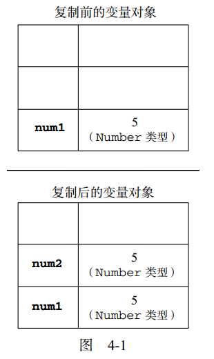
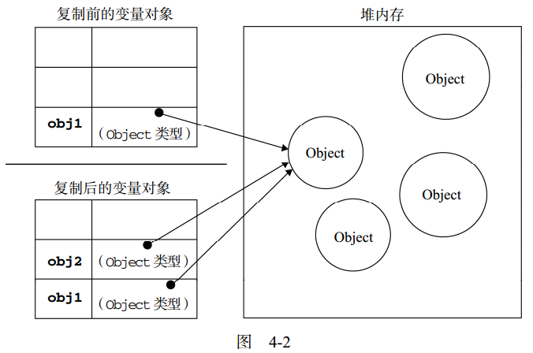
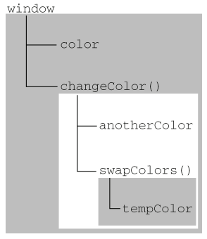

# 变量、作用域和内存问题

## 本章内容
1. 理解基本类型和引用类型的值
2. 理解执行环境
3. 理解垃圾回收

## 简述
* 按照ECMA-262的定义，JavaScript的变量与其他语言的变量其实有很大的区别。JavaScript变量松散类型的本质，决定了他只是在特定的时间用于保存特定值的一个名字而已，由于不存在定义某个变量必须要 保存何种数据类型值的规则，所以变量的值和类型和一在脚本的声明周期内改变，而且JavaScript的变量复杂程度远远不止于此。

## 基本类型和引用类型的值
* ECMAScript变量可能包含两种不同数据类型的值，基本类型值和引用类型值。基本类型值指的是简单的数据段，而引用类型值指那些可能由多个值构成的对象。
* 将一个值赋给变量时，解析器必须确定这个值是基本类型还是引用类型。5中基本数据类型为Undefined、Null、Boolean、Number、String.基本数据类型是按值来访问的。可以操作保存在变量中的实际的值。

### 动态的属性
* 定义基本类型值和引用类型值的方式是类似的，创建一个变量并为该变量赋值。但是当这个值保存到变量中以后，对不同类型值能够进行很多不同的操作。对于引用类型值，我们可以为其添加属性和方法，也可以改变和删除其属性和方法。
    ```
        var person = new Object();
        person.name = 'lcwspr';
        alert(person.name)   // lcwspr
    ```
* 但是我们不能够给基本类型的值添加属性，尽管不会导致错误。
    ```
        var name = 'lcwspr';
        name.age = 34;
        alert(name.age);    // undefined
    ```
### 复制变量的值
* 除了保存的方式不同，在从一个变量向另一个变量复制基本类型值和引用类型值的时候，也存在不同。
    * 如果从一个变量向另一个变量复制基本类型值，会在变量对象上创建一个新的值，然后把值复制到为新变量分配的位置上。 并且两个值是完全独立的。之后可以参加任何操作而不会互相影响
        * 例子
            ```
                var num1 = 5;
                var num2 = num1;  
            ```
        * 
    * 当从一个变量向另一个变量复制引用类型的值时，同样也会将存储在变量对象中的值赋值一份放到为新变量分配的空间中。不同的是，这个值的副本实际上是一个指针，而这个指针指向存储在堆内存中的一个对象。复制结束后，两个对象实际将引用同一个对象。
        * 例子
            ```
                var obj1 = new Object();
                var obj2 = obj1;
                obj1.name = 'lcwspr';
                alert(obj2.name);      // lcwspr
            ```
        * 

### 传递参数
* ECMAScript中所有函数的参数都是按值传递的，也就是说，把函数外部的值复制给函数内部的参数，就和把值从一个变量复制到另一个变量一样。基本类型值的传递如同基本类型值的传递，引用类型值的传递，和引用变量的复制一样
* 向参数传递基本类型的值时，被传递的值会被复制给一个局部变量(命名参数，或arguments对象中的一个元素)。向参数传递引用类型的值时，会把这个值在内存中的地址复制给一个局部变量。
* 例子
    * 基本类型值的传递
        ```
            function addTen(num){
                num += 10;
                return num;                
            }

            var count = 20;
            var result = addTen(count);
            alert(count);  // 20,没有变化
            alert(result); // 30
        ```
        * 对于基本类型值，相当于就是传递的是值的拷贝，函数的参数是外部变量值的拷贝，两者之间除了值相等没有其余的联系。如果修改内部的变量对于外界变量没有任何影响
    * 应用类型值的传递
        ```
            function setName(obj){
                obj.name = 'hello world';
            }

            var person = new Object();
            setName(person);
            alert(person.name);    // 'hello world'
        ```
        * 以上代码创建了一个对象，并将其保存在变量person中。然后这个变量被传递到setName()函数之后就被赋值给了obj。函数内部obj和person引用的是同一个对象(相当于是保存的一个地址，他们都能访问操作相应地址上的值)。所以对于函数内部添加name属性，会在外部体现出来。
        * 例子二(演示如果改变这个地址)
            ```
                function setName(obj){
                    obj.name = 'lcwspr';
                    obj = new Object();
                    obj.name = "Greg";
                }
                var person = new Object();
                setName(person);
                alert(person.name);  'lcwspr' 
            ```
            * 与前一个例子的区别是添加了两行代码，创建了一个新的obj对象，然后给其一个不同的name属性值。因为改变了创建了一个新的对象，改变obj对象的地址指向，此时obj对象不再指向外界的person对象，所以不再能够修改外界的属性值。

### 检测类型
* 要检测一个变量是不是基本数据类型？之前介绍过的typeof操作符是最佳的工具。其实说的具体一些，typeof操作符是确定一个变量是字符串、数值、布尔值还是undefined的最佳工具。如果变量的值是一个对象或者是null，那么typeof操作符只会返回"objcet"
* 所以说，检测基本数据类型typeof是非常好用的助手，但是检测应用类型时，这个操作符通常没有什么作用。对于一个引用数据类型我们不关心他是不是对象，我们需要知道的是他是什么类型的对象，所以ECMAScript提供了instanceof操作符
    * 语法
        * result = variable instanceof constructor
    * 如果变量是给定引用类型(根据原型链来识别)的实例，那么instanceof操作符就会返回true.
    * 根据规定，所以的引用类型都是Object的实例，当然如果使用instanceof操作符检测基本类型值，那么始终会返回false.

## 执行环境和作用域
* 执行环境(有时候也简称为环境)是JavaScript中最为重要的一个概念。执行环境定义了变量或者函数有权访问的其他数据，决定了他们各自的行为。每个执行环境都有一个与之关联的变量对象(variable object),环境中定义的所有变量和函数都保存在这个对象中，有时我们编写的代码无法访问到这个对象，但是解析器在处理数据时在后台会使用它。
* 全局执行环境是最外围的一个执行环境。根据ECMAScript实现所在的宿主环境不同，表示执行环境的对象也是不一样的，在Web浏览器中，全局执行环境被认为是window对象。因此所有的全局变量和函数都是作为window对象的属性和方法创建的。某个执行环境中的所有代码执行完毕后，该环境被销毁，保存在其中的所有变脸和函数定义也会随之销毁
* 每个函数都有自己的执行环境，当执行流进入一个函数时，函数的环境就会被推入一个环境栈中，而在函数执行之后，栈将其环境弹出，把控制权返回给之前的执行环境。ECMAScript程序中的执行流程正是由这个方便的机制控制。
* 当代码在一个环境中执行，回创建变量对象的一个作用域链。用途是保证对执行环境有权访问的所有变量和函数的有序访问。作用域链的最前端，始终是当前执行的代码所在环境的变量对象，如果这个环境是函数，则将其活动对象作为变量对象。最开始只包含一个变量，就是arguments对象(全局环境不存在)。作用域链中的下一个变量对象来自包含(外部环境)，在下一个变量对象则来自下一个包含环境。这样一直延续到全局执行环境，全局执行环境的变量对象始终都会是作用域链中的最后一个对象。
* 标识符解析是沿着作用域链一级一级的搜索标识符的过程。搜索过程始终从作用域链的前端开始，然后逐级的向后回溯，直到找到标识符为止(如果找不到标识符，通常会导致错误发生)
* 例1
    ```
        var color = 'blue';
        function changeColor(){
            if(color === 'blue'){
                color = 'red';
            }else{
                color = 'blue'
            }
        }
        changeColor();
        alert('Color is now ' + color);
    ```
    * 解析
        * 这个简单的例子中，函数changeColor()的作用域链包含两个对象，他自己的变量对象(定义中arguments对象)和全局环境的变量对象，可以在函数内部访问变量color,就是因为可以在这个作用域链中找到他。

* 例2 -> 在局部作用域中定义的变量可以在局部环境中与全局变量互换使用。
    ```
        var color = 'blue';
        function changeColor(){
            var anotherColor = 'red';

            function swapColors(){
                var tempColor = anotherColor;
                anotherColor = color;
                color = tempColor;

                // 这里可以访问color、anotherColor和tempColor
            }

            // 这里可以访问 color和anotherColor
            swapColors();
        }

        // 这里只能访问color
        changeColor();
    ```
    * 访问图解
    * 
    * 矩形区域表示特定的执行环境，内部环境可以通过作用域链访问所有的外部环境，但是外部环境不能够访问内部的环境，在实例中其作用域包含3个对象：swapColors()的变量对象、changeColor()的变量对象和全局变量对象。

### 延长作用域链
* 虽然执行环境的类型总共只有两种--全局和局部，但是还有其他办法能够延长作用域链。因为有些语句可能在作用域前端临时增加一个变量对象，该变量对象会在代码执行后被移除，在下面两种情况发生，具体地说，就是执行流程进入下面任何一个语句，作用域链会得到加长。
    1. try-catch语句的catch块
    2. with语句

### 没有块级作用域
* JavaScript没有块级作用域经常会导致理解上的困惑。其他类C语言中，有花括号封闭的代码都有自己的作用域(ECMAScript来说就是他们自己的执行环境)，因而支持根据条件来定义变量，但是js中不支持块级代码块。
* 声明变量
    * 使用var声明的变量会自动被添加到最接近的环境中。在环境内部，最接近的环境就是函数的局部环境，在with语句中，最接近的环境就是函数环境。如果初始化变量没有使用var,该变量会被自动添加到全局环境。
    ```
        function add(num1, num2){
            var sum = num1 + num2;
            return sum;
        }
        var result = add(10, 20);  // 30
        alert(sum);                // 由于sum不是有效的变量会导致错误
                                   // sum是add函数定义的局部变量，函数外部访问不到

        // 如果省略关键字var，那么将会在全局创建一个变量。但不推荐使用全局变量
    ```
* 查询标识符
    * 当在某个环境中为了读取或写入而引用一个标识符时，必须通过搜索来确定该标识符实际代表什么。搜索过程从作用域链的最前端开始，向上逐级查询与给定名字匹配的标识符。如果在局部环境中找到了该标识符，搜索过程停止，变量就绪。如果在局部环境中没有找到该变量名，则继续沿作用域向上搜索。搜过过程一直到全局环境的变量对象。如果在全局环境中也没有找到这个标识符，则意味着该变量尚未声明。

## 垃圾收集
* JavaScript具有自动垃圾收集机制，也就是说，执行环境会负责管理代码执行过程中使用的内存。在c类语言，手动跟踪内存的使用情况，造成了许多问题的一个根源。js中开发人员不在关系内存使用情况。原理很简单，找出不在继续使用的变量，然后释放其占用的内存。为此垃圾回收器会按照固定的时间间隔周期执行这一操作。

